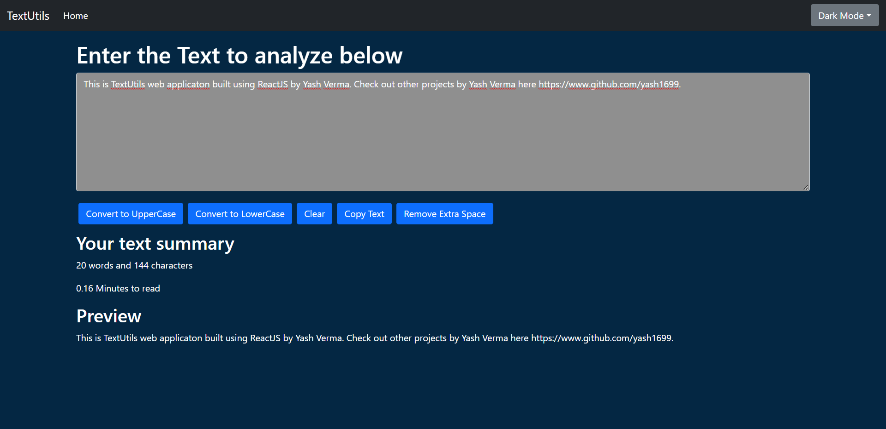

# TextUtils | Analyze your text

TextUtils is a web appliation built using ReactJS. It is a text analyzer application. User can also perform a set of given operation on the text.

## Table Of Contents

- [Overview](#overview)
  - [The Project](#the-project)
  - [Screenshot](#screenshot)
  - [Link](#link)
- [Development](#development)
  - [Tech Stack](#tech-stack)
  - [What i learned](#what-i-learned)
  - [Useful Resources](#useful-resources)
- [Author](#author)

## Overview

### The Project

TextUtils is a text analyzer web application built using ReactJS. It can be used to analyze a given text. TextUtils can count the no. of words and characters present in the text. It can also calculate an average time required to read the text. There is a set of operation given to user which can be performed on the text. The operation provide are
`Convert to Upercase`: Convert all the letters in the text to UpperCase characters
`Convert to Lowercase`: Convert all the letters in the text to Lowercase characters
`Clear`: Deletes the whole text
`Copy text`: Copies the text to clipboard
`Remove extra space`: Removes any extra spaces present in the text.

There three options for Dark Mode available - `Dark Blue` `Dark Red` `Dark Green` 

The Front End design of the project is fully-responsive.

### Screenshot

### Link

[Live Site URL](https://yash1699.github.io/textutils/)

## Development

### Tech Stack

- HTML5 markup
- CSS custom properties
- Bootstrap
- Javascript
- ReactJS Library

### What i learned

I learned using ReactJs by building this awesome project. I learned to implement dark mode which was a plus for me.

### Useful Resources

There were times when i got stuck on some things while working on this project, for which i took help from a few websites which was very much helpful for me. The websites that helped me the most are:
- [StackOverflow](https://stackoverflow.com) for debugging and
- [YouTube](https://youtube.com) for learning new things.

## Author

- GitHub - [@yash1699](https://github.com/yash1699)
- LinkedIn - [@yash-verma-5a84641a9](https://linkedin.com/in/yash-verma-5a84641a9)